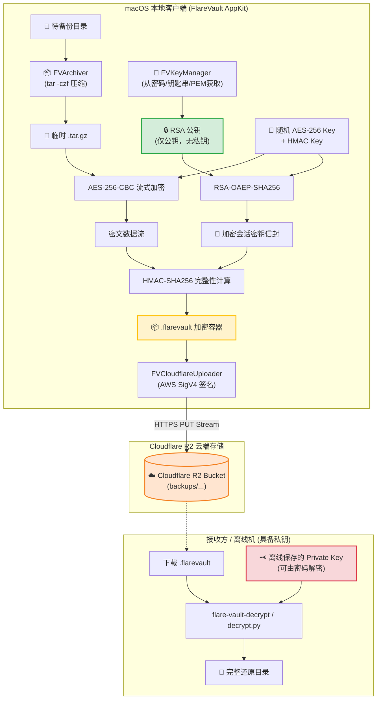

# FlareVault (macOS AppKit)

> **安全的 macOS 目录非对称加密打包与 Cloudflare R2 自动化备份工具**  
> 纯 **Objective-C + AppKit** 打造（零 Swift 依赖），遵循**单向加密安全模型（仅持有公钥，本地只能加密、绝对无法解密）**。

[](https://www.apple.com/macos/)
[](https://developer.apple.com/documentation/appkit)
[](#-安全与加密架构)
[-F38020?logo=cloudflare)](https://www.cloudflare.com/products/r2/)
[](LICENSE)

---

## 🌟 核心特性

- **🚀 纯原生 AppKit 架构**：无任何 Swift 运行时或三方包依赖，极小体积（原生二进制仅 ~200KB），冷启动瞬间完成，支持 macOS 12 Monterey 至最新 macOS 版本。
- **🛡️ 非对称单向加密模型（Encrypt-Only）**：
  - macOS 备份客户端**仅加载并持有非对称公钥**（`SecKeyRef` of class `kSecAttrKeyClassPublic`）。
  - **程序内无私钥、不可逆向解密**。即使备份机被盗或被入侵，攻击者也绝对无法解密任何已归档的历史数据。
- **🔑 支持从密码获取公钥（Password-Derived Public Key）**：
  - 支持输入主密码安全生成高强度非对称密钥对（2048 / 4096-bit RSA），私钥导出到离线安全介质（例如冷备 U 盘），本机仅保留公钥。
  - 支持与 macOS 钥匙串（Keychain Generic Password）双向同步与管理公钥。
  - 支持直接粘贴或载入标准 PEM 公钥（`-----BEGIN PUBLIC KEY-----`）。
- **📦 工业级流式打包与混合加密**：
  - **纯内存与进程内流式打包（Zero-Subprocess）**：原生代码实现 POSIX USTAR / GNU 规范的 TAR 打包与 `zlib` 流式压缩，**不调用 `/usr/bin/tar` 或衍生子进程**，彻底消除被安全软件（EDR / 杀软）作为恶意子进程拦截或告警的风险。完整保留目录结构、文件权限（POSIX）、符号链接与时间戳。
  - 采用**混合信封加密体制**：动态生成一次性 256-bit AES 会话密钥与 256-bit HMAC 密钥，用 RSA-OAEP-SHA256 公钥加密信封。
  - 流式分块分段加密（1MB 缓冲），处理数十 GB 超大目录时常驻内存仍小于 15MB。
  - **Encrypt-then-MAC 强认证**：全报文计算 HMAC-SHA256，严防位翻转与密文篡改。
- **🗂️ 多目录批量配置与独立管线**：
  - 原生 `NSTableView` 目录清单管理，支持一次性多选添加（`NSOpenPanel allowsMultipleSelection`）与直接从 Finder 拖拽多个文件夹至列表。
  - 每行目录支持独立勾选启用/停用、即时查看目录名称、快照模式状态与完整路径。
  - 任务管线（`FVTaskPipeline`）按序自动串行处理所有已启用的目录，各个目录的快照账本、加密归档与云端存储路径相互独立隔离。
- **⏱️ 增量备份与快照差异链（带删除墓碑）**：
  - 基于文件修改时间（mtime）、体积与快速校验的本地快照账本（Snapshot Ledger），自动跳过未变更文件，大幅降低带宽与加密开销。
  - 完整记录文件删除“墓碑”（Tombstones），跨版本还原时自动清理失效文件，保证目录状态完全一致。
- **🧹 rsync 风格目录排除过滤（Exclude Filters）**：
  - **开箱即用内置规则**：默认内置并自动过滤现代项目中最庞大繁杂的开发与缓存缓冲目录，包括 `node_modules`、`node_moudles`、`.venv`、`venv`、`env`、`.env`、`__pycache__`、`*.pyc`、`*.pyo`、`.DS_Store`、`.git`、`.svn`、`.hg`、`build`、`dist`、`.cache`、`.next`、`.nuxt`、`target`、`Pods`、`DerivedData` 等。
  - **自定义排除通配符**：支持用户自定义输入类似 `rsync --exclude` 的排除通配规则（如 `*.tmp`, `test_data/`, `*.log`, `cache/*` 等），支持空格或逗号分隔。
  - **高性能剪枝扫描与进程内过滤**：在目录扫描与打包时使用 `NSDirectoryEnumerator skipDescendants` 直接剪枝跳过被排除的庞大目录树（避免扫描数十万小文件），零子进程原生打入压缩流。
- **☁️ 直传 Cloudflare R2 对象存储**：
  - 原生 Objective-C 实现 AWS Signature Version 4 (SigV4) 鉴权。
  - 流式并发上传至 Cloudflare R2，实时显示传输百分比、已上传字节数及动态传输日志。
  - 支持将 Cloudflare Access Key 和 Secret Key 密文加密托管在 macOS 系统的安全钥匙串中。
- **🥷 惰性随机上传模式（防内网流量突发与 DLP 误杀）**：
  - **不是简单的限速，而是呈现离散调用的感觉**：将大归档拆解为动态变长分块（5MB~8MB 随机抖动），在分块间注入密码学时序随机停顿（例如 2s ~ 8s 随机静默）与突发模拟。
  - 打破传统备份工具恒定流速或固定包大小的特征指纹，模拟正常离散应用请求，避免触发企业内网 IDS/IPS/DLP 监控系统的突发流量误杀。
- **🛠️ 跨平台解密套件**：
  - 随仓库附带原生解密命令行工具 `build/flare-vault-decrypt`（Objective-C）。
  - 附带零三方依赖的 Python 解密脚本 `Scripts/decrypt.py`（跨平台支持 Linux/Windows/macOS）。

---

## 📐 系统架构与数据流



---

## 🗂️ 目录结构

```
flare-vault/
├── FlareVault/
│   ├── Main/
│   │   ├── main.m                      # 应用程序入口
│   │   ├── FVAppDelegate.h / .m        # 原生菜单与生命周期委托
│   ├── UI/
│   │   ├── FVMainWindowController.h/.m # AppKit 主窗口与全响应式界面
│   │   ├── FVDragDropView.h / .m       # 目录拖拽放置区
│   ├── Core/
│   │   ├── FVCryptoEngine.h / .m       # 非对称信封流加密核心引擎
│   │   ├── FVKeyManager.h / .m         # 密码派生与公钥钥匙串管理
│   │   ├── FVArchiver.h / .m           # 目录打包与解包
│   │   ├── FVCloudflareUploader.h / .m # Cloudflare R2 AWS SigV4 传输模块
│   │   ├── FVConfigManager.h / .m      # 本地设置与钥匙串凭证托管
│   │   ├── FVTaskPipeline.h / .m       # 打包-加密-上传流水线调度器
│   ├── Resources/
│   │   ├── Info.plist                  # macOS App Bundle 元信息
│   │   ├── AppIcon.icns                # 高清视网膜应用图标
├── Tools/
│   ├── flare-vault-decrypt.m           # 原生 C/ObjC 解密命令行工具源码
│   ├── generate_icon.m                 # 视网膜应用图标生成程序
├── Scripts/
│   ├── decrypt.py                      # 跨平台 Python 离线解密脚本
│   ├── generate_keypair.sh             # RSA 非对称密钥对生成辅助脚本
│   ├── test_e2e.sh                     # 端到端闭环验证测试套件
├── Tests/
│   ├── test_crypto.m                   # 密码引擎单元测试
│   ├── test_keymanager.m               # 密钥管理器单元测试
│   ├── test_archiver.m                 # 归档压缩单元测试
│   ├── test_uploader.m                 # Cloudflare 配置与上传测试
├── FlareVault.xcodeproj/              # 完整 Xcode 工程
├── Makefile                            # 编译构建、测试与运行指令
├── README.md                           # 项目技术文档与使用手册
└── LICENSE                             # 开源许可 (MIT)
```

---

## 🔐 安全与加密容器规范 (`.flarevault`)

生成的 `.flarevault` 文件采用二进制信封布局，格式紧凑、自包含元数据并具备抗篡改保护：

| 偏移 (Offset) | 字段名 | 长度 (Bytes) | 描述 |
| :--- | :--- | :--- | :--- |
| `0x00 - 0x03` | Magic | 4 | 魔数标识符 `FLAR` (`0x46 0x4C 0x41 0x52`) |
| `0x04` | Version | 1 | 协议版本，当前为 `0x01` |
| `0x05` | Cipher Suite | 1 | 加密算法标识，`0x01` = RSA-OAEP-SHA256 + AES-256-CBC |
| `0x06 - 0x07` | EncKeyLen | 2 (Big-Endian) | 被加密会话密钥的长度 $N$（如 2048 位密钥为 256 字节） |
| `0x08 - (0x07+N)` | EncKeyData | $N$ | RSA 公钥加密的会话包（包含 32B AES Key + 32B HMAC Key） |
| 次 16 字节 | IV | 16 | AES-256-CBC 密码学随机初始向量 |
| 次 32 字节 | HMAC Tag | 32 | HMAC-SHA256 签名（覆盖头部与所有密文数据） |
| 次 2 字节 | MetaLen | 2 (Big-Endian) | 元数据 JSON 字节长度 $M$ |
| 次 $M$ 字节 | Metadata | $M$ | 包含原始目录名、原始大小、文件数、时间戳的 JSON 字符串 |
| 剩余所有字节 | Ciphertext | 变长 | AES-256-CBC 加密后的 `tar.gz` 压缩文件流 |

---

## 🥷 惰性随机上传机制（防内网误杀设计）

很多企业内网、防火墙、安全网关或终端 DLP 会监控网络流量特征：
- **单纯限制带宽速率**（如限速 500KB/s）仍然会形成一条长时间、持续不断的连续 TCP 数据流，这种恒定流特征很容易被网络行为分析（NTA）标记并拦截。
- **FlareVault 惰性上传的解决方案**：通过**离散随机调用（Stochastic Discrete Calling）**彻底打破流量指纹：
  1. **动态变长分块（Jittered Chunking）**：基于 S3 Multipart Upload 协议，但摒弃了固定大小分块，每个分块在 5MB ~ 8MB 之间随机浮动，破除固定的报文分包指纹；
  2. **随机间歇与时序抖动（Inter-call Jitter）**：每个分块上传完毕后，系统随机进入非线性静默休眠（如 2.0s ~ 8.0s 任意毫秒级浮动），将持续大流分散为一个个独立的短周期请求；
  3. **突发调用模拟（Burst Simulation）**：以预设概率（约 20%）触发短间隔连续上传，模拟人类正常使用应用产生偶发网络突发的自然行为；
  4. **全阶段可随时优雅取消**：后台多段会话会在取消时自动发送 S3 Abort 指令，不留任何云端残余。

---

## 🚀 快速上手

### 1. 编译构建与测试

在项目根目录下，直接使用 `make` 构建：

```bash
# 1. 编译 App 应用程序与 CLI 解密工具
make

# 2. 运行全部单元测试及端到端（打包->公钥加密->解密->SHA256校验）测试套件
make test

# 3. 启动 macOS 原生 GUI 应用程序
make run
```

编译产物位于 `build/` 目录：
- `build/FlareVault.app`：原生 macOS 应用程序。
- `build/flare-vault-decrypt`：离线解密命令行工具。

---

### 2. 界面使用指南

打开 **FlareVault** 应用后，仅需 4 步完成安全备份：

1. **选择目录与排除规则**：
   - 点击 **“浏览...”** 选取，或直接**拖拽目标文件夹**到下方的拖拽区域中。
   - **默认排除过滤**：应用默认勾选“默认排除开发与缓存目录”，自动屏蔽 `node_modules`、`.venv`、`venv`、`__pycache__`、`.git`、`build`、`dist` 等。
   - **自定义排除规则**：可在输入框填入类似 `rsync --exclude` 的自定义通配符（如 `*.tmp, cache/*, secret.key`），以空格或逗号分隔。
   - 界面会即时显示过滤后的文件总数、体积以及排除过滤的项数。
2. **装载公钥（仅加密模式）**：
   - **方式 A（从密码生成）**：输入您的主密码，点击“生成新密钥对并提取公钥”。系统会弹窗引导您将解密用的私钥另存至安全离线介质（如 USB 盘），而应用本身**仅保留公钥**。
   - **方式 B（从钥匙串获取）**：点击“从钥匙串读取公钥”，直接从 macOS Keychain 中载入已存公钥。
   - **方式 C（直接导入 PEM）**：点击“选择公钥文件...”或在文本框中粘贴 `-----BEGIN PUBLIC KEY-----` 格式的 RSA 公钥。
3. **配置 Cloudflare R2**：
   - 填写 Cloudflare **Account ID**、**Bucket Name**、**Access Key ID** 与 **Secret Access Key**。
   - 可选自定义远程前缀路径（默认为 `backups/`）。
   - 点击 **“测试 Cloudflare 连接”**，验证网络与 Bucket 权限无误。
   - 勾选“安全保存凭据到 macOS 钥匙串”，后续免去重复输入。
4. **开始打包上传**：
   - 点击 **“🚀 开始打包、加密并上传至 Cloudflare”**。
   - 实时控制台会详细输出每一步进度，完成后将给出 Cloudflare R2 远程对象 URL。

---

### 3. 数据还原与离线解密

在安全离线机器或远端灾备节点上，使用您的解密私钥解密还原备份文件：

#### 方法 A：使用原生 C/ObjC CLI 工具 (`flare-vault-decrypt`)
```bash
./build/flare-vault-decrypt \
  -k /path/to/flarevault_private_key.pem \
  -i backup_20260930_120000.flarevault \
  -o ./restored_directory/
```
若私钥设置了密码保护，加上 `-p <密码>` 即可：
```bash
./build/flare-vault-decrypt \
  -k private.pem \
  -p "MySecretVault2026!" \
  -i backup.flarevault \
  -o ./restored/
```

#### 方法 B：使用跨平台 Python 脚本 (`Scripts/decrypt.py`)
无需安装额外 pip 依赖，在任何装有 Python 3 和 openssl 的 Linux / macOS 环境下均可运行：
```bash
python3 Scripts/decrypt.py \
  --key /path/to/flarevault_private_key.pem \
  --input backup.flarevault \
  --output ./restored/
```

---

## 🛡️ 安全承诺与隔离保证

1. **绝对单向加密**：
   - 应用程序核心代码通过 Apple `Security.framework` 创建 `kSecAttrKeyClassPublic` 对象。
   - 代码中不存在任何使用本地公钥解密的逻辑（尝试解密将触发系统的底层安全拒绝 `RSAdecrypt wrong input (err -27)`）。
2. **密钥零驻留**：
   - 在从密码派生密钥对后，私钥立即导出到用户指定的文件，内存中的私钥结构被彻底清零释放。
3. **安全凭据存储**：
   - Cloudflare API 敏感私密密钥通过 macOS Keychain 服务（`kSecClassGenericPassword`）硬件级加密存储，绝不以明文形式保存在 plist 或 UserDefaults 中。

---

## 📄 开源许可证

本项目基于 [MIT License](LICENSE) 授权许可。
